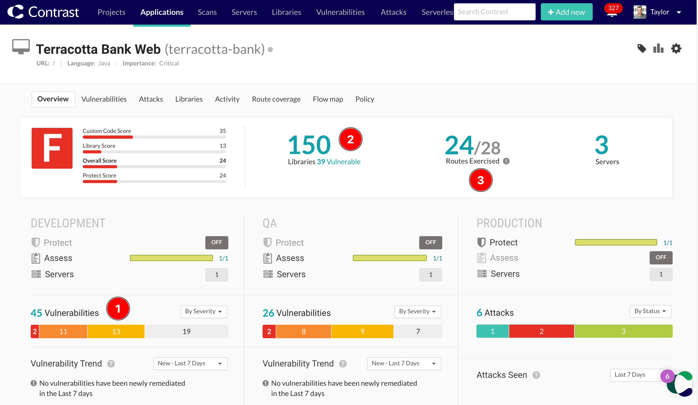

# Contrast Security Demo: RailsGoat

**A deliberately vulnerable Ruby on Rails application with added Contrast Security Instrumentation.** 

This demo will give you hands on experience with Contrast Security's instrumentation and observability technology. You'll learn how to onboard an application to the Contrast platform, and can then get hands with Contrast Assess and Contrast Protect:
* **Contrast Assess** combines Interactive Application Security Testing (IAST) and Software Composition Analysis (SCA) to provide visibility into vulnerabilities across your custom code and third party libraries. 
* **Contrast Protect** is Runtime Application Self Protection (RASP) that protects applications in production by blocking attacks and complex exploitation in real time. 

### About Contrast Security
Contrast Security is the leader in modernized application security, embedding code analysis and attack prevention directly into software with patented security instrumentation technology. [Find out more about Contrast on our website.](https://www.contrastsecurity.com/contrast-assess)

### About RailsGoat
RailsGoat is a deliberately vulnerable Ruby on Rails application, based on [OWASP RailsGoat](https://github.com/OWASP/railsgoat). We've added some Contrast dependencies to this project to help you get started quickly. 

# Running the demo application
## Run with Docker (Quick Start)
To get started quickly and easily with RailsGoat and the Contrast Agent, you can pull our already-prepared docker image from Docker Hub.

First, retrieve your agent keys from the Contrast Platform. To find your organization keys please follow this [documentation](https://docs.contrastsecurity.com/en/find-the-agent-keys.html). Then run the following command, adding in your agent keys in place of `XXXXXX`:

```bash
docker run -it --rm -p 3000:3000 \
  -e CONTRAST__API__URL=https://eval.contrastsecurity.com/Contrast \
  -e CONTRAST__API__API_KEY=XXXXXX \
  -e CONTRAST__API__SERVICE_KEY=XXXXXX \
  -e CONTRAST__API__USER_NAME=XXXXXX \
  contrastsecuritydemo/railsgoat:6.1.7
```

## Build and run with Docker
To build and run RailsGoat locally, first clone this repo to your local machine, and ensure you have [Docker](https://docs.docker.com/engine/installation/) and [Docker Compose](https://docs.docker.com/compose/install/) installed. You can then use the provided Dockerfile and Docker Compose configuration to build the container and start instances of RailsGoat with the Contrast agent installed.

First, retrieve your agent keys from the Contrast Platform. To find your organization keys please follow this [documentation](https://docs.contrastsecurity.com/en/find-the-agent-keys.html). 

Set your agent keys either by adding them to the `contrast_security.yaml` file in the `config` directory, or by adding them to the `.env` file in the root directory (you can also find other agent configuration options in these files). 

You can now build and run the container using Docker Compose:
```sh
docker-compose up --build 
```

By default, two RailsGoat instances will be started, one with Contrast Assess enabled, and one with Contrast Protect enabled. You can start only one service with this command: 

```sh
docker-compose up railsgoat-dev
docker-compose up railsgoat-prod
``` 

Open your favorite browser and navigate to http://localhost:3000 for Assess or http://localhost:3001 for Protect.


## Running standalone

**Warning**: The computer running this application will be vulnerable to attacks, please take appropriate precautions.

You can run RailGoat locally on any machine with Ruby, Rails, MySQL, Postgres installed.

First, retrieve your agent keys from the Contrast Platform. To find your organization keys please follow this [documentation](https://docs.contrastsecurity.com/en/find-the-agent-keys.html). 

Set your agent keys either by adding them to the `contrast_security.yaml` file in the `config` directory.

Install the dependencies using bundler:
```sh
  bundle install
```

If you receive an error, make sure you have `bundler` installed:

```bash
$ gem install bundler
```

Start the Thin web server:

```sh
  rails server
```

Open your favorite browser and navigate to http://localhost:3000.


## Other Deployment Options
There are other options for deploying RailsGoat. Please see the docs/ folder for more instructions: 
* [Deploying to Azure App Services](docs/DEPLOY_TO_AZURE.md)

# Testing RailsGoat with Contrast Assess (IAST)
Interactive Application Security Testing (IAST) works by observing application behavior at runtime to identify vulnerabilities as you interact with the application. To start analysis, all you need to do is start browsing around the application to exercise routes and the agent will analyse each request and how the application responds. Routes can also be exercised by automated functional testing such as integration and end-to-end tests.

### Test the application manually

Try logging in to the application using the supplied credentials, logging out again, creating a new user for yourself and browsing some of the other pages and functionality in the app.

When you're done exploring the application, look at the Contrast Platform to see if any vulnerabilities were detected. You'll also see any vulnerable libraries that were detected, as well as the route coverage that you've achieved with your manual testing.



### Test the application with automated tests

RailsGoat includes a set of failing Capybara RSpecs, each one indicating that a separate vulnerability exists in the application. To run them, you first need to install [PhantomJS](https://github.com/jonleighton/poltergeist#installing-phantomjs) (version 2.1.1 has been tested in Dev and on Travis CI), which is required by the Poltergeist Capybara driver. Upon installation, simply run the following task:

```sh
rails training
```

For Docker run:

```sh
docker compose exec railsgoat-dev rails training

# OR

docker run \
  -v $PWD/contrast_security.yaml:/myapp/contrast_security.yaml \
  -e CONTRAST__APPLICATION__NAME=railsgoat \
  -e TEST=true \
  -p 3000:3000 railsgoat:latest
```

# License

[The MIT License (MIT)](./LICENSE.md)
